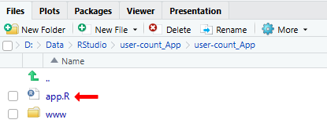
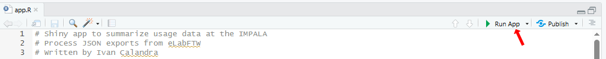
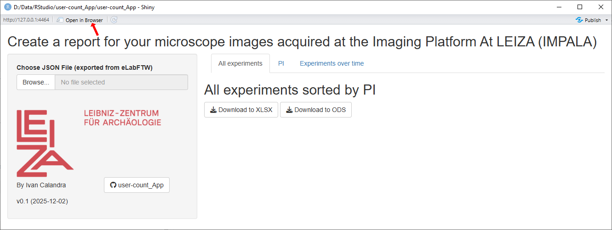
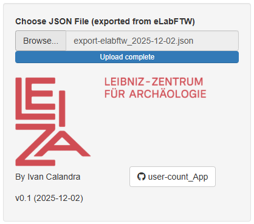
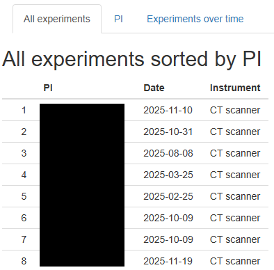
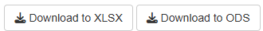
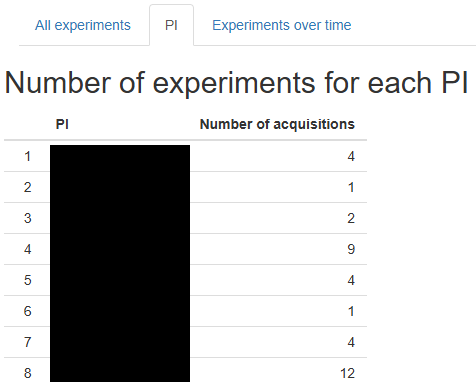
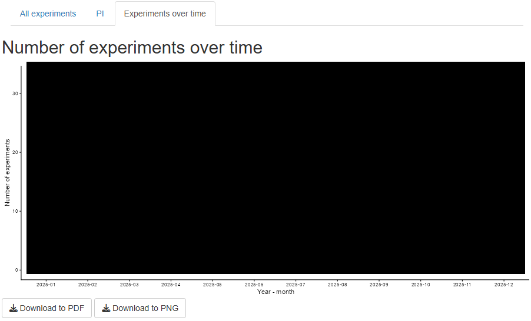

<!-- TOC ignore:true -->
# user-count_App

<!-- TOC ignore:true -->
## Table of content

<!-- TOC -->

- [Purpose](#purpose)
- [How to use the App](#how-to-use-the-app)
    - [On the LEIZA server](#on-the-leiza-server)
    - [Locally with RStudio](#locally-with-rstudio)
        - [Pre-requisites](#pre-requisites)
        - [Download the repository](#download-the-repository)
        - [Start the App](#start-the-app)
    - [Save input](#save-input)
- [Operating instructions](#operating-instructions)
    - [Side bar](#side-bar)
    - [Tab "All experiments"](#tab-all-experiments)
    - [Tab "PI"](#tab-pi)
    - [Tab "Experiments over time"](#tab-experiments-over-time)
- [How to adapt the App](#how-to-adapt-the-app)
- [How to contribute](#how-to-contribute)
- [License](#license)

<!-- /TOC -->

---

*The releases are available and citable on Zenodo*  

---

# Purpose

This repository contains a [**Shiny App**](user-count_App/app.R) to summarize usage data at the [IMPALA](https://www.leiza.de/forschung/infrastrukturen/labore/impala) from experiments exported from [eLabFTW](https://www.elabftw.net/) as a single JSON file. **This App is meant only for internal purpose.** 

If you would like to adapt the App to your needs, check the sections [How to adapt the App](#how-to-adapt-the-app), [How to contribute](#how-to-contribute) and [License](#license).

---

# How to use the App

## On the LEIZA server
**The easiest is to run the App on the LEIZA server:** https://tools.leiza.de/user-count/

## Locally with RStudio
Alternatively, the App can also be run locally using RStudio.  
This option is especially useful if you intend to edit the App (see sections [How to adapt the App](#how-to-adapt-the-app) and [How to contribute](#how-to-contribute)).

### Pre-requisites
The Shiny App is written in [Shiny](https://shiny.posit.co/) using [RStudio](https://posit.co/products/open-source/rstudio/), so you first need to download and install [R](https://www.r-project.org/) and [RStudio](https://posit.co/download/rstudio-desktop/). But fear not, **no knowledge of R/Rstudio is needed to run the App**!

### Download the repository
There are two ways to get the App: 
1. Download my [GitHub repository](https://github.com/ivan-paleo/user-count_App/archive/refs/heads/main.zip) or its latest [release](https://github.com/ivan-paleo/user-count_App/releases) as a ZIP archive, and unzip it. You can access the repository with the source code by clicking on the button in the side bar of the App (see [side bar](#side-bar)).  
2. [Fork and clone](https://happygitwithr.com/fork-and-clone.html) my [GitHub repository](https://github.com/ivan-paleo/user-count_App).

### Start the App
1.  Open the file [user-count_App.Rproj](user-count_App.Rproj) with RStudio.
2.  Open the file `user-count_App/app.R` from within RStudio by clicking on it in the `Files` panel.

>

>     
>    <i>Open the App from within RStudio.</i>
>

3.  Run the App by clicking on the button `Run App` in the top right corner.

>

>     
>    <i>Run the App from within RStudio.</i>
>

4.  The App will open in a new RStudio window. I recommend to open the App in your browser (click on `Open in Browser` at the top to open the App), and to maximize the window (or at least make it large enough so that the fields do not overlap).

>

>     
>    <i>App freshly opened (no input yet).</i>
>

5.  Enter the information as explained in the following section ([Operating instructions](#operating-instructions)).

## Save input
**In both cases (LEIZA server and local), no input is saved in the App.** If you close the App (or the browser tab), all input will be deleted.  
The only way to save input is by using the download buttons at the end of each tab.

---

# Operating instructions
## Side bar
Upload a single JSON file of the experiments exported from eLabFTW by clicking on *Browse*. 

The content of the tabs is generated automatically from the input file.

Click the icon *user-count_App* to open the repository on GitHub.

>

>     
>    <i>Sidebar with JSON file uploaded.</i>
>

## Tab "All experiments" 
In this tab, all experiments from the JSON file are listed, sorted by PI. The instrument for each experiment is shown as well.

>

>     
>    <i>Tab "All experiments" with JSON file uploaded (names of PI hidden).</i>
>

The table can be downloaded to XLSX or ODS files but clicking on the buttons at the bottom of the tab.

>

>     
>    <i>Buttons to download to XLSX and ODS.</i>
>

## Tab "PI" 
In this tab, the number of experiments (acquisitions) is shown per PI.

>

>     
>    <i>Tab "PI" with JSON file uploaded (names of PI hidden).</i>
>

The table can be downloaded to XLSX or ODS files but clicking on the buttons at the bottom of the tab.

>

>     
>    <i>Buttons to download to XLSX and ODS.</i>
>

## Tab "Experiments over time" 
In this tab, the evolution of the number of experiments (acquisitions) is shown over time.  
The graph can be downloaded to PDF or PNG files but clicking on the buttons at the bottom of the tab.

>

>     
>    <i>Tab "Experiments over time" with JSON file uploaded (data hidden).</i>
>

---

# How to adapt the App
I have tried to make the code of the App as clear as possible and to comment it as much as possible. This is surely not perfect, but I hope this will be enough for future developments and adaptations.

If you would like to adapt the App to your needs, feel free to do so on your own (see section [Download the repository](#download-the-repository)). Nevertheless, **I would appreciate if you would be willing to [contribute](#how-to-contribute)**! You can also get in touch with me directly.

---

# How to contribute
I appreciate any comment from anyone (expert or novice) to improve this App, so do not be shy!  
There are three possibilities to contribute.

1.  Submit an issue: If you notice any problem or have a question, submit an [issue](https://docs.github.com/en/issues/tracking-your-work-with-issues/learning-about-issues/about-issues). You can do so [here](https://github.com/ivan-paleo/user-count_App/issues).  
2.  Propose changes: If you know how to write a [Shiny App](https://shiny.rstudio.com/), please propose text edits as a [pull request](https://docs.github.com/en/pull-requests/collaborating-with-pull-requests/proposing-changes-to-your-work-with-pull-requests/about-pull-requests) (abbreviated "PR").
3.  Send me an email: For options 1-2, you need to create a GitHub account. If you do not have one and do not want to sign up, you can still write me an email (Google me to find my email address).

By participating in this project, you agree to abide by our [code of conduct](CONDUCT.md).

---

# License

This work is licensed under a [Creative Commons Attribution-NonCommercial-ShareAlike 4.0 International License](http://creativecommons.org/licenses/by-nc-sa/4.0/). See [LICENSE](LICENSE).

Author: Ivan Calandra

---

*License badge, file and image from Soler S. cc-licenses: Creative Commons Licenses for GitHub Projects, <https://github.com/santisoler/cc-licenses>.*
